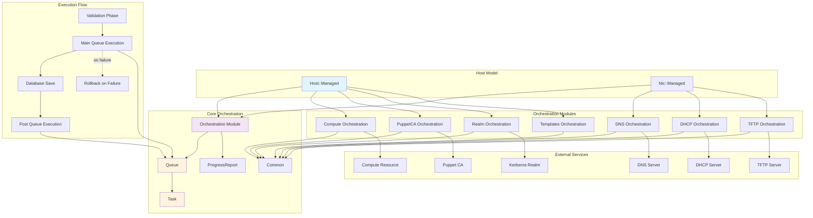
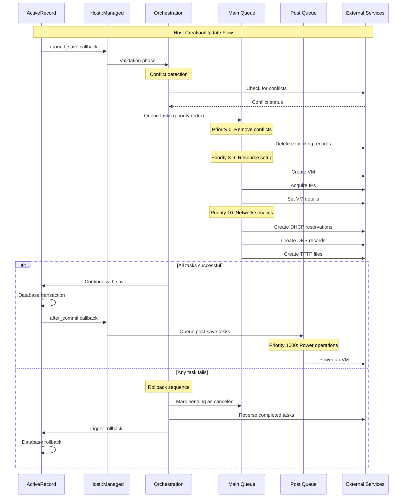

# Foreman Provisioning Orchestration Design

## Overview

Foreman's provisioning orchestration framework is a Ruby-based system that coordinates the complex set of tasks required to provision and manage hosts. It handles resource allocation, configuration deployment, and cleanup across multiple external services (DHCP, DNS, TFTP, compute resources, etc.) while ensuring atomicity and rollback capabilities.

## Core Architecture

### Architecture Diagram



### Main Components

The orchestration framework consists of several key components located in `/app/models/concerns/orchestration/`:

1. **Core Orchestration Module** (`orchestration.rb`)
   - Provides the base framework and lifecycle management
   - Implements two-phase execution with rollback capability
   - Manages task queues and execution flow

2. **Task and Queue Management** (`/app/services/orchestration/`)
   - **Queue** (`queue.rb`): Manages ordered task execution
   - **Task** (`task.rb`): Represents individual orchestration operations

3. **Specialized Orchestration Modules**
   - **DNS** (`dns.rb`): Forward and reverse DNS record management
   - **DHCP** (`dhcp.rb`): DHCP reservation management  
   - **TFTP** (`tftp.rb`): PXE boot file management
   - **Compute** (`compute.rb`): Virtual machine lifecycle management
   - **PuppetCA** (`puppet_ca.rb`): Certificate authority operations
   - **Realm** (`realm.rb`): Kerberos realm operations
   - **Templates** (`templates.rb`): Template rendering and deployment

### Integration Points

The orchestration framework is primarily integrated into:
- **Host::Managed** (`app/models/host/managed.rb:299-313`): Main host orchestration
- **Nic::Managed** (`app/models/nic/managed.rb:3-7`): Network interface orchestration

## Task Execution Model

### Two-Phase Execution

The orchestration framework uses a two-phase commit pattern:

1. **Main Queue** (`queue`): Executes during `around_save` callback
   - Runs before the ActiveRecord save operation
   - If any task fails, triggers rollback of completed tasks
   - Prevents database save if orchestration fails

2. **Post Queue** (`post_queue`): Executes after successful save via `after_commit`
   - Runs only after database transaction commits
   - Used for operations that require the record to be persisted

### Task Execution Flow



### Task Structure

Each task in the orchestration system has the following attributes:
```ruby
# From app/services/orchestration/task.rb:3
attr_reader :id, :name, :status, :priority, :action, :timestamp, :created
```

**Task Status Lifecycle:**
```
pending → running → completed/failed/conflict/canceled
                 ↘ rollbacked (during failure recovery)
```

**Task Priorities:** Tasks are executed in priority order (lower numbers first):
- Priority 0-5: Cleanup/conflict resolution
- Priority 6-10: Resource creation (DNS, DHCP, TFTP)
- Priority 1000: VM power operations (last)

### Rollback Mechanism

When any task fails, the orchestration framework:
1. Marks pending tasks as "canceled"
2. Reverses completed tasks in reverse order
3. Converts method names (e.g., `set_dhcp` → `del_dhcp`)
4. Triggers ActiveRecord rollback to prevent database changes

## Orchestration Modules Deep Dive

### DNS Orchestration (`dns.rb`)

**Purpose:** Manages forward and reverse DNS records for hosts

**Key Methods:**
- `dns?`: Checks if forward DNS is required
- `dns6?`: Checks if IPv6 DNS is required  
- `reverse_dns?`/`reverse_dns6?`: Checks if reverse DNS is required
- `queue_dns_create/update/destroy`: Queues appropriate DNS tasks

**Task Flow:**
1. Conflict detection and cleanup (priority 0)
2. Delete old records if updating (priority 9)
3. Create new records (priority 10)

### DHCP Orchestration (`dhcp.rb`)

**Purpose:** Manages DHCP reservations and PXE boot configuration

**Key Methods:**
- `dhcp?`: Determines if DHCP reservation is needed
- `dhcp_records`: Builds DHCP record objects for provisioning MACs
- `dhcp_conflict_detected?`: Validates no conflicting reservations exist

**Special Features:**
- Supports multiple MAC addresses for bonded interfaces
- Handles PXE boot configuration (next-server, filename)
- Integrates with jumpstart and ZTP provisioning

### Compute Orchestration (`compute.rb`)

**Purpose:** Manages virtual machine lifecycle on compute resources

**Key Operations:**
1. **VM Creation Flow:**
   - Render user data template (priority 2)
   - Create VM instance (priority 3)
   - Acquire IP addresses (priority 4)
   - Query instance details (priority 5)
   - Set IPAM addresses (priority 6)
   - Power up VM (priority 1000)

2. **VM Attributes:**
   - Merges user-defined and compute resource defaults
   - Handles image-based vs. network-based provisioning
   - Manages network interface MAC address assignment

### TFTP Orchestration (`tftp.rb`)

**Purpose:** Manages PXE boot files and configuration

**Key Features:**
- Generates OS-specific boot files
- Handles different PXE loaders (GRUB, iPXE, etc.)
- Integrates with template rendering system
- Supports both IPv4 and IPv6 TFTP

## Host Provisioning Workflow

### New Host Creation

1. **Validation Phase:**
   - Check for DNS/DHCP conflicts
   - Validate compute resource configuration
   - Verify template availability

2. **Main Queue Execution:**
   ```
   Priority 0: Remove conflicts (if overwrite enabled)
   Priority 3: Create VM (if compute resource)
   Priority 4: Acquire IPs from compute
   Priority 5: Query VM details
   Priority 6: Set IPAM addresses
   Priority 9: Remove old records (updates only)
   Priority 10: Create DHCP reservations
   Priority 10: Create DNS records
   Priority 10: Create TFTP files
   ```

3. **Database Save:** ActiveRecord transaction commits

4. **Post Queue Execution:**
   ```
   Priority 1000: Power up VM
   Priority 1000: Additional post-save operations
   ```

### Host Updates

The framework detects changes requiring orchestration updates:
- IP address changes
- Hostname changes  
- MAC address changes
- Operating system changes
- Build status changes

Updates follow a delete-then-create pattern to ensure consistency.

### Host Deletion

During host destruction:
1. Disassociate VM (if `destroy_vm_on_host_delete` is false)
2. Execute deletion tasks in priority order
3. Clean up all external resources

## Error Handling and Recovery

### Conflict Detection

The framework proactively detects conflicts:
- **DNS Conflicts:** Existing A/AAAA/PTR records
- **DHCP Conflicts:** IP/MAC address reservations
- **VM Conflicts:** Existing instances with same identifier

### Rollback Strategy

On failure, the framework:
1. Logs detailed error information
2. Executes rollback methods for completed tasks
3. Prevents database changes via ActiveRecord rollback
4. Reports conflicts separately from failures

### Testing Considerations

The framework includes built-in test safety:
```ruby
def skip_orchestration_for_testing?
  Rails.env.test?
end
```

This prevents side effects during test execution unless explicitly enabled.

## Progress Tracking and Monitoring

### Progress Reports

The framework provides progress tracking via `ProgressReport` module:
- Generates unique progress report IDs
- Caches task status in Rails cache
- Enables real-time progress monitoring

### Task Status Monitoring

Each task maintains timestamps and status:
```ruby
# Task status with timing
{ 
  :id => id, 
  :name => name, 
  :timestamp => timestamp, 
  :status => status, 
  :priority => priority, 
  :created => created 
}
```

## Design Patterns and Principles

### Separation of Concerns

Each orchestration module focuses on a single external service:
- DNS module only handles DNS operations
- DHCP module only handles DHCP operations
- Clear interface boundaries between modules

### Template Method Pattern

Base `Orchestration` module defines the execution flow:
```ruby
def around_save_orchestration
  process :queue
  yield  # ActiveRecord save
rescue => e
  fail_queue queue
  raise e
end
```

Specialized modules implement specific operations.

### Strategy Pattern

Different provisioning methods (network, image, userdata) trigger different orchestration strategies while using the same framework.

### Command Pattern

Tasks encapsulate operations with rollback capability:
```ruby
# Forward operation
[object, :set_dhcp, params]
# Rollback operation (automatically derived)
[object, :del_dhcp, params]
```

## Current Limitations and Challenges

Based on the [community discussion](https://community.theforeman.org/t/orchstration-framework-problems/21020), the current framework has several known limitations:

### Technical Limitations

1. **No Explicit SQL Transactions:** Cannot use database transactions for atomic operations
2. **No Background Processing:** All operations are synchronous
3. **Limited Parallelization:** Tasks execute sequentially
4. **Tight Coupling:** Orchestration tied to ActiveRecord model lifecycle
5. **Debugging Complexity:** Difficult to trace failures across external services

### Operational Challenges

1. **Error Recovery:** Limited ability to recover from partial failures
2. **Long-Running Operations:** Blocks request handling during execution
3. **Scalability:** Cannot distribute orchestration load
4. **Monitoring:** Limited visibility into orchestration progress

## Future Considerations and Redesign Proposals

The community has discussed several approaches for modernizing the orchestration framework:

### Short-term Improvements (ActiveJob Integration)
- Move long-running tasks to background jobs
- Enable parallel execution of independent tasks
- Better error handling and retry mechanisms

### Enhanced Logging and Monitoring
- Detailed orchestration audit trails
- Real-time progress tracking
- Better failure diagnostics

### Plugin Architecture
- Maintain backward compatibility
- Allow plugins to extend orchestration
- More flexible task composition

### Long-term Architectural Redesign

Based on the [provisioning redesign proposal](https://community.theforeman.org/t/foreman-provisioning-provisioning-re-design-proposal/3568), the community has considered more fundamental changes:

#### Separate Provisioning Object
**Current State:** Provisioning logic is tightly coupled to the Host model
**Proposed Change:** Create a dedicated `Provisioning` object that:
- Holds all provisioning-related information
- Connects targets (hosts) to their provisioning process
- Removes provisioning concerns from the Host model

**Benefits:**
- Reduces Host model complexity
- Enables multiple provisioning attempts per host
- Clearer separation of concerns

#### Modular Provisioning Strategies
**Current State:** Orchestration modules mixed into Host model
**Proposed Change:** Strategy pattern with dedicated classes:
```ruby
# Conceptual design
class PXEProvisioningStrategy
  include Orchestration::DNS
  include Orchestration::DHCP 
  include Orchestration::TFTP
end

class ImageProvisioningStrategy
  include Orchestration::Compute
  include Orchestration::DNS
end
```

**Benefits:**
- Clear separation of provisioning methods
- Easier testing and maintenance
- Plugin-friendly architecture

#### Enhanced State Tracking
**Current State:** Limited visibility into orchestration progress
**Proposed Change:** Introduce `ProvisioningSnap` objects to track:
- Provisioning states: New → In Process → Success/Failure
- Detailed step-by-step progress
- Historical provisioning attempts

#### Alternative Orchestration Engines

The community has discussed replacing the current orchestration framework with more mature solutions:

**Dynflow Integration:**
- Workflow engine with built-in error handling
- Support for long-running operations
- Better retry and recovery mechanisms
- Already used in parts of Foreman ecosystem

**Benefits of Modern Orchestration:**
- Native support for background processing
- Better error recovery and retry logic
- Improved monitoring and logging
- Distributed execution capabilities

#### Migration Strategy Considerations

Any future redesign must address:

1. **Backward Compatibility:** Existing plugins rely on current orchestration hooks
2. **Data Migration:** Existing hosts need graceful transition to new system
3. **API Stability:** External integrations depend on current behavior
4. **Plugin Ecosystem:** Many plugins extend orchestration modules

#### Comparison: Current vs. Proposed Architecture

| Aspect | Current System | Proposed System |
|--------|----------------|-----------------|
| **Coupling** | Tight (Host model) | Loose (Separate objects) |
| **Extensibility** | Module inclusion | Strategy classes |
| **State Tracking** | Limited | Comprehensive |
| **Background Jobs** | None | Native support |
| **Error Recovery** | Basic rollback | Advanced retry logic |
| **Testing** | Complex (side effects) | Isolated strategies |
| **Monitoring** | Cache-based | Rich state tracking |

## Conclusion

Foreman's orchestration framework provides a robust foundation for coordinating complex provisioning workflows. While it has served the project well, its synchronous, tightly-coupled design reflects earlier architectural decisions that may benefit from modernization as the project evolves.

The framework's strength lies in its atomic operation guarantees and comprehensive rollback capabilities. However, future development should consider asynchronous processing, better scalability, and enhanced observability to meet modern infrastructure automation needs.