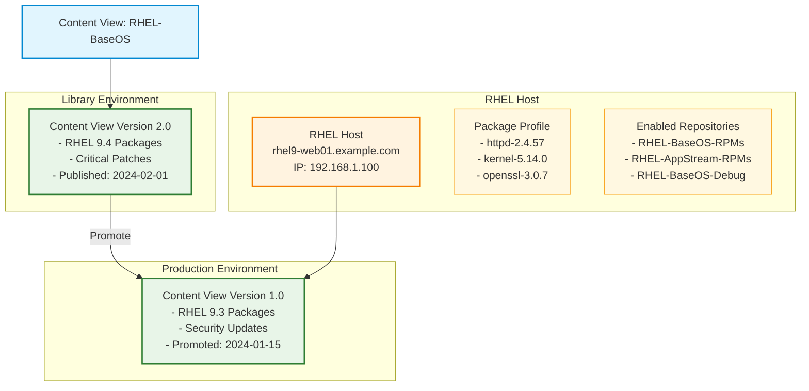

# Content View Lifecycle Environment Diagram

This diagram illustrates how content views work with lifecycle environments in Katello, showing versions in Library and Production environments with a RHEL host consuming content.

## Key Concepts

### Content View
- **RHEL-BaseOS**: A content view containing base RHEL packages and updates
- Serves as a template for creating consistent package sets across environments

### Lifecycle Environments
- **Library**: Default environment where new content is published and tested
- **Production**: Stable environment running previously tested and promoted content

### Content View Versions
- **Version 1.0**: Stable version in Production with RHEL 9.3 packages
- **Version 2.0**: Newer version in Library with RHEL 9.4 packages, ready for testing

### Host Registration
- **RHEL Host**: Production server consuming content from Production environment
- **Package Profile**: Current installed packages reported back to Katello for tracking
- **Enabled Repositories**: Active repository subscriptions providing access to content
- Receives packages and updates from Content View Version 1.0 (stable/tested)
- Uses subscription-manager to connect to Katello for content access

## Workflow
1. New content is published to **Library** as Version 2.0
2. Content is tested and validated in Library environment
3. Once validated, Version 2.0 will be **promoted** to Production (replacing Version 1.0)
4. Production hosts currently consume stable content from Version 1.0
5. Hosts receive consistent, tested package sets through the content view system
