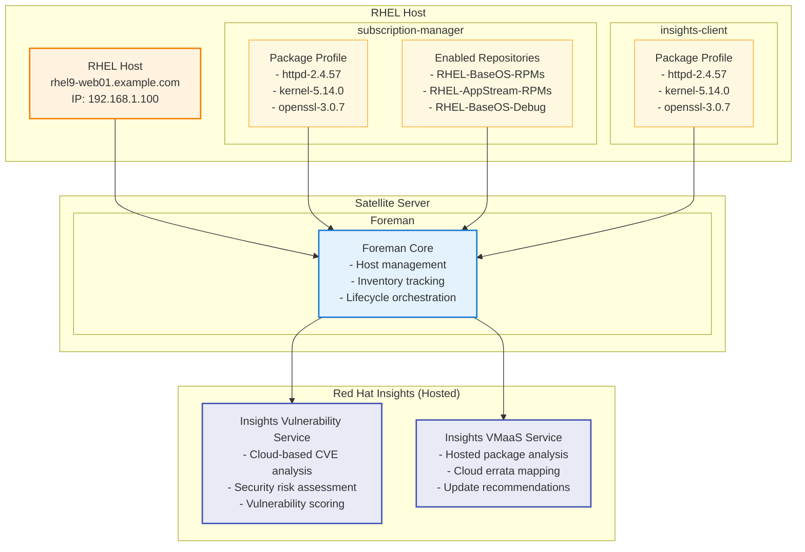

# Red Hat Insights Hosted Architecture Diagram

This diagram illustrates how RHEL hosts communicate with Satellite Server's Foreman component, which then interacts with hosted Red Hat Insights services in the cloud for vulnerability management and package analysis.

## Key Components

### RHEL Host
- **Host System**: Production RHEL server running various applications
- **subscription-manager**: Manages subscriptions and repository access
  - **Package Profile**: Installed packages reported to Satellite
  - **Enabled Repositories**: Active repository subscriptions
- **insights-client**: Red Hat Insights agent for cloud-based vulnerability assessment
  - **Package Profile**: Package inventory sent to hosted Insights services

### Satellite Server
- **Foreman Core**: Central management component for host lifecycle management
- Orchestrates communication between hosts and hosted Insights services
- Manages inventory tracking and policy enforcement

### Red Hat Insights (Hosted Cloud Services)
- **Insights Vulnerability Service**: Cloud-hosted vulnerability analysis
  - Performs comprehensive CVE analysis using Red Hat's security database
  - Provides security risk assessment and vulnerability scoring
  - Leverages cloud-scale threat intelligence and analysis capabilities
- **Insights VMaaS Service**: Cloud-hosted package analysis service
  - Maps installed packages to available errata and updates
  - Provides update recommendations and compatibility analysis
  - Maintains comprehensive package and vulnerability databases

## Workflow
1. **Data Collection**: Both subscription-manager and insights-client collect package profiles from RHEL hosts
2. **Foreman Integration**: Package data flows to Foreman for centralized inventory management
3. **Cloud Communication**: Foreman sends package profiles directly to hosted Insights services
4. **Cloud Vulnerability Analysis**: Insights Vulnerability Service performs comprehensive security assessment
5. **Cloud Package Analysis**: Insights VMaaS Service analyzes packages for available updates and errata
6. **Response Integration**: Results flow back to Foreman for host management decisions and policy enforcement

## Benefits of Hosted Architecture
- **Always Updated**: Cloud services maintain the latest vulnerability and package databases
- **Scalable Analysis**: Leverages Red Hat's cloud infrastructure for comprehensive analysis
- **Reduced Infrastructure**: No need to maintain on-premises IoP services
- **Expert Maintenance**: Cloud services are maintained and updated by Red Hat security experts