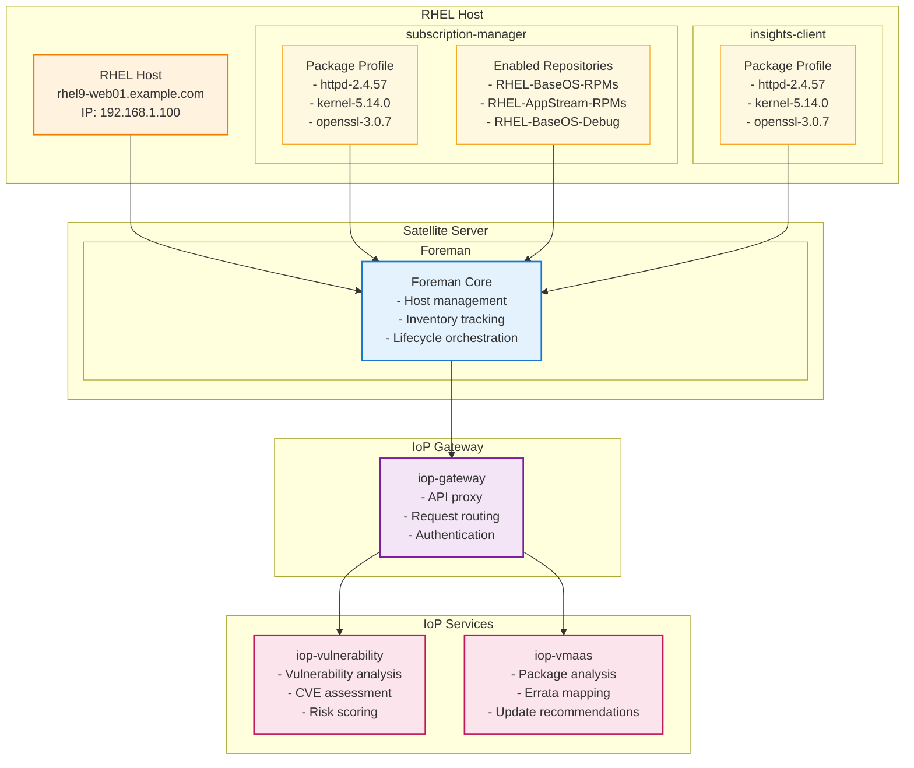

# IoP (Insights-on-Prem) Architecture Diagram

This diagram illustrates how RHEL hosts communicate with Satellite Server's Foreman component, which then interacts with IoP services through the iop-gateway for vulnerability management and package analysis.

## Key Components

### RHEL Host
- **Host System**: Production RHEL server running various applications
- **subscription-manager**: Manages subscriptions and repository access
  - **Package Profile**: Installed packages reported to Satellite
  - **Enabled Repositories**: Active repository subscriptions
- **insights-client**: Red Hat Insights agent for vulnerability assessment
  - **Package Profile**: Package inventory sent to IoP services

### Satellite Server
- **Foreman Core**: Central management component for host lifecycle management
- Orchestrates communication between hosts and IoP services
- Manages inventory tracking and policy enforcement

### IoP Gateway
- **iop-gateway**: API gateway and proxy service
- Routes requests between Foreman and IoP backend services
- Handles authentication and request transformation

### IoP Services
- **iop-vulnerability**: Vulnerability analysis service
  - Performs CVE assessment and risk scoring
  - Analyzes security implications of installed packages
- **iop-vmaas**: Package analysis service (VMware as a Service)
  - Maps packages to available errata
  - Provides update recommendations and compatibility analysis

## Workflow
1. **Data Collection**: Both subscription-manager and insights-client collect package profiles from RHEL hosts
2. **Foreman Integration**: Package data flows to Foreman for centralized inventory management
3. **IoP Communication**: Foreman sends package profiles to IoP services via iop-gateway
4. **Vulnerability Analysis**: iop-vulnerability performs security assessment of installed packages
5. **Package Analysis**: iop-vmaas analyzes packages for available updates and errata
6. **Response Aggregation**: Results flow back through iop-gateway to Foreman for host management decisions