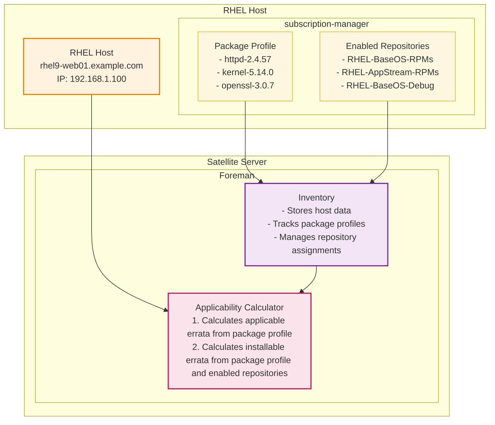

# Satellite Server Applicability Calculator Diagram

This diagram illustrates how RHEL hosts communicate with Satellite Server's Foreman component to calculate package applicability.

## Key Components

### RHEL Host
- **Host System**: Production RHEL server running various applications
- **Package Profile**: Current installed packages reported to Satellite for tracking
- **Enabled Repositories**: Active repository subscriptions providing access to content

### Satellite Server
- **Central management server** running Red Hat Satellite
- Contains Foreman for host lifecycle management and inventory tracking

### Foreman Inventory
- **Host Data Storage**: Centralized repository of host information
- **Package Profile Tracking**: Maintains current package installations for each host
- **Repository Management**: Tracks which repositories are enabled for each host

### Foreman Applicability Calculator
- **Package Analysis**: Compares installed packages with available updates
- **Security Assessment**: Identifies security patches and critical updates
- **Compliance Tracking**: Monitors host compliance with defined policies
- **Update Planning**: Calculates which packages need updates or patches

## Workflow
1. **Host Registration**: RHEL host registers with Satellite Server
2. **Data Collection**: Package profiles and enabled repositories are sent to Foreman Inventory
3. **Inventory Storage**: Foreman Inventory stores and manages host data centrally
4. **Applicability Analysis**: Inventory data feeds into Applicability Calculator
5. **Update Calculation**: Calculator determines applicable updates and security patches
6. **Compliance Assessment**: System tracks compliance status and generates reports