# Foreman Global Registration API Analysis

## Overview

This document provides a comprehensive analysis of the API calls made during Foreman Global Registration, based on log analysis from a complete host registration workflow. The analysis covers the sequence of operations, performance characteristics, backend service interactions, and optimization opportunities.

## Test Environment Configuration

**Important**: This analysis was performed under the following specific conditions:

1. **Manifest Status**: Red Hat subscription manifest imported and active
2. **Repository Configuration**: RHEL 9 BaseOS repository enabled and fully synchronized
3. **Activation Key**: Using activation key named "rhel9" configured for RHEL 9 content
4. **Registration Method**: Foreman Global Registration feature
5. **Host OS**: Red Hat Enterprise Linux 9.6 (x86_64)

These conditions represent a typical production-ready Foreman/Katello environment. Performance characteristics may vary with different configurations, repository sizes, network conditions, or when using different activation keys or content sets.

## Registration Workflow Summary

Global Registration is a multi-phase process that involves:
1. **Initial Registration Script Download** - Host downloads registration script
2. **Subscription Manager Registration** - Host registers with Candlepin via RHSM APIs
3. **Host Registration** - Foreman creates host record and sets build mode
4. **Package Management Setup** - Profile upload and repository configuration
5. **Insights Integration** - Red Hat Insights client registration and data upload
6. **Build Completion** - Host signals successful setup

## Detailed Registration Flow Phases

### Phase 1: Registration Script Download (15:41:19)
**Duration**: ~1 second
**Key Operations**:
- `GET /register?activation_keys=rhel9&download_utility=curl&location_id=2&organization_id=1&update_packages=false`
- **Duration**: 103ms
- **Purpose**: Generate and download the registration script containing all necessary commands

**Performance**: Fast and efficient, well-optimized endpoint.

### Phase 2: Subscription Manager Registration (15:41:22-15:41:28)
**Duration**: ~6 seconds
**Key Operations**:
1. **RHSM Resource Discovery**:
   - `GET /rhsm/` - Discover available RHSM endpoints (11ms)

2. **Consumer Creation** ⚠️ **CRITICAL PATH BOTTLENECK**:
   - `POST /rhsm/consumers?owner=Default_Organization&activation_keys=rhel9`
   - **Duration**: 3,256ms (longest operation in entire flow)
   - **Operations**:
     - Host record creation in Foreman database
     - Network interface (Nic::Managed) creation
     - Content and Subscription facets creation
     - Facts import (193 facts)
     - Candlepin consumer registration
     - UUID generation and assignment

3. **Certificate and Content Management**:
   - Certificate serial retrieval (140ms)
   - Certificate download (249ms)
   - Content access validation (33ms)
   - Content overrides check (25ms)
   - Release information (25ms)

4. **Compliance Status Validation**:
   - Initial compliance checks begin (multiple 29ms calls)

### Phase 3: Host Registration (15:41:28)
**Duration**: ~1 second
**Key Operations**:
- `POST /register` with UUID and host parameters
- **Duration**: 267ms
- **Operations**:
  - Host parameter creation (`host_update_packages=false`)
  - Build mode activation (`build=true`)
  - Build initiation timestamp setting
  - Host ownership assignment

**Performance**: Efficient parameter setup and build mode activation.

### Phase 4: Package Management Setup (15:41:29-15:41:37)
**Duration**: ~8 seconds
**Key Operations**:
1. **Package Profile Upload**:
   - `PUT /rhsm/consumers/{uuid}/profiles`
   - **Duration**: 253ms
   - **Purpose**: Upload installed package inventory to Candlepin

2. **Repository Metadata Synchronization**:
   - Multiple large file downloads from Pulp:
     - `repomd.xml` (4KB)
     - `primary.xml.gz` (74MB) - **Largest download**
     - `filelists.xml.gz` (8MB)
     - `comps.xml` (290KB)
     - `updateinfo.xml.gz` (1.2MB)

**Performance**: Network-bound due to large repository metadata files.

### Phase 5: Insights Integration (15:41:39-15:42:03)
**Duration**: ~24 seconds
**Key Operations**:
1. **Insights Client Initialization**:
   - Multiple `GET /redhat_access/r/insights/v1/branch_info` calls (8 total)
   - Each call: 16-53ms

2. **Module Update Checks**:
   - `GET /redhat_access/r/insights/platform/module-update-router/v1/channel`
   - **Duration**: 1,028ms (external Red Hat API call)

3. **Insights Core Download**:
   - `GET /redhat_access/r/insights/v1/static/release/insights-core.egg`
   - **Duration**: 187ms (1.3MB download)
   - Signature file download (86ms)

4. **System Registration**:
   - `POST /redhat_access/r/insights/v1/systems`
   - **Duration**: 207ms

5. **Data Upload**:
   - `POST /redhat_access/r/insights/uploads/{uuid}`
   - **Duration**: 232ms (compressed system data)

6. **Inventory and Reports**:
   - Platform inventory registration (143-179ms)
   - System reports retrieval (348ms)

**Performance**: External service dependency creates latency; multiple round trips.

### Phase 6: Final Status Updates (15:42:01-15:42:05)
**Duration**: ~4 seconds
**Key Operations**:
1. **Continued Compliance Polling** ⚠️ **PERFORMANCE ISSUE**:
   - Ongoing `GET /rhsm/consumers/{uuid}/compliance` calls
   - **Total**: 13 calls throughout registration
   - Each call: 24-33ms

2. **Facts Update**:
   - `PUT /rhsm/consumers/{uuid}` (facts update)
   - **Duration**: 765ms
   - **Operations**: Import 201 additional facts

3. **Final Validations**:
   - Content access, certificate serials, overrides verification
   - Consumer details retrieval

### Phase 7: Build Completion (15:42:01)
**Duration**: ~1 second
**Key Operations**:
- `GET /unattended/built?token=21fefcb4-e580-4c71-895c-4816741b55fa`
- **Duration**: 159ms
- **Operations**:
  - Set `build=false`
  - Set `installed_at` timestamp
  - Trigger build completion events

**Performance**: Efficient final state transition.

## Registration Sequence Diagram

The following sequence diagram illustrates the complete flow of API calls during Global Registration:

```mermaid
sequenceDiagram
    participant Host as Host System
    participant Foreman as Foreman Server
    participant Candlepin as Candlepin
    participant Pulp as Pulp
    participant RHCloud as Red Hat Cloud
    participant Browser as Admin Browser

    Note over Host,RHCloud: Phase 1: Registration Script Download
    Host->>Foreman: GET /register?activation_keys=rhel9&...
    Note right of Foreman: 103ms - Generate registration script
    Foreman-->>Host: Registration script

    Note over Host,RHCloud: Phase 2: Subscription Manager Registration
    Host->>Foreman: GET /rhsm/
    Foreman->>Candlepin: Forward request
    Candlepin-->>Foreman: RHSM resource list
    Foreman-->>Host: RHSM endpoints

    Host->>Foreman: POST /rhsm/consumers?owner=Default_Organization&activation_keys=rhel9
    Note right of Foreman: 3,256ms - LONGEST OPERATION
    Foreman->>Candlepin: Create consumer
    Foreman->>Pulp: GET /pulp/api/v3/status/ (2x)
    Foreman->>Foreman: Create host record & facets
    Foreman->>Foreman: Import facts (193 facts)
    Candlepin-->>Foreman: Consumer created
    Foreman-->>Host: Consumer details + certificates

    loop Status and Certificate Checks
        Host->>Foreman: GET /rhsm/status
        Foreman->>Candlepin: Forward request
        Candlepin-->>Foreman: Status
        Foreman-->>Host: Status (12 total calls)

        Host->>Foreman: GET /rhsm/consumers/{uuid}/certificates/serials
        Foreman->>Candlepin: Forward request
        Candlepin-->>Foreman: Certificate serials
        Foreman-->>Host: Serials (6 total calls)
    end

    Host->>Foreman: GET /rhsm/consumers/{uuid}/certificates?serials=...
    Foreman->>Candlepin: Forward request
    Note right of Candlepin: 249ms
    Candlepin-->>Foreman: Certificates
    Foreman-->>Host: Certificate data

    loop Content Access Validation
        Host->>Foreman: GET /rhsm/consumers/{uuid}/accessible_content
        Foreman->>Candlepin: Forward request
        Candlepin-->>Foreman: Content list / 304 Not Modified
        Foreman-->>Host: Accessible content (6 total calls)

        Host->>Foreman: GET /rhsm/consumers/{uuid}/content_overrides
        Foreman->>Candlepin: Forward request
        Candlepin-->>Foreman: Overrides
        Foreman-->>Host: Content overrides
    end

    Host->>Foreman: GET /rhsm/consumers/{uuid}/release
    Foreman->>Candlepin: Forward request
    Candlepin-->>Foreman: Release info
    Foreman-->>Host: Release version

    loop Excessive Compliance Polling
        Host->>Foreman: GET /rhsm/consumers/{uuid}/compliance
        Foreman->>Candlepin: Forward request
        Candlepin-->>Foreman: Compliance status
        Foreman-->>Host: Compliance data
        Note over Host,Candlepin: 13 total calls - PERFORMANCE ISSUE
    end

    Note over Host,RHCloud: Phase 3: Host Registration
    Host->>Foreman: POST /register
    Note right of Foreman: 267ms - Set host parameters & build mode
    Foreman->>Foreman: Update host build=true
    Foreman->>Foreman: Set parameters
    Foreman-->>Host: Registration confirmation

    Note over Host,RHCloud: Phase 4: Package Management
    Host->>Foreman: PUT /rhsm/consumers/{uuid}/profiles
    Note right of Foreman: 253ms - Upload package profiles
    Foreman->>Candlepin: Update profiles
    Candlepin-->>Foreman: Profile updated
    Foreman-->>Host: Success

    Host->>Pulp: GET /pulp/content/.../repodata/repomd.xml
    Pulp-->>Host: Repository metadata
    Host->>Pulp: GET /pulp/content/.../primary.xml.gz
    Pulp-->>Host: Package data (74MB)
    Host->>Pulp: GET /pulp/content/.../filelists.xml.gz
    Pulp-->>Host: File lists (8MB)
    Host->>Pulp: GET /pulp/content/.../updateinfo.xml.gz
    Pulp-->>Host: Update info

    Note over Host,RHCloud: Phase 5: Insights Integration
    loop Insights Branch Info
        Host->>Foreman: GET /redhat_access/r/insights/v1/branch_info
        Foreman->>RHCloud: Forward to Red Hat Cloud
        RHCloud-->>Foreman: Branch information
        Foreman-->>Host: Branch info (8 total calls)
    end

    Host->>Foreman: GET /redhat_access/r/insights/platform/module-update-router/v1/channel
    Note right of Foreman: 1,028ms - External Red Hat API
    Foreman->>RHCloud: Forward request
    RHCloud-->>Foreman: Module update info
    Foreman-->>Host: Update channel

    Host->>Foreman: GET /redhat_access/r/insights/v1/static/release/insights-core.egg
    Note right of Foreman: 187ms - Download Insights core
    Foreman->>RHCloud: Forward request
    RHCloud-->>Foreman: Insights core package (1.3MB)
    Foreman-->>Host: Package data

    Host->>Foreman: GET /redhat_access/r/insights/v1/static/release/insights-core.egg.asc
    Foreman->>RHCloud: Forward request
    RHCloud-->>Foreman: Signature file
    Foreman-->>Host: Signature

    Host->>Foreman: POST /redhat_access/r/insights/v1/systems
    Note right of Foreman: 207ms - Register with Insights
    Foreman->>RHCloud: Forward system registration
    RHCloud-->>Foreman: Registration response
    Foreman-->>Host: Registration confirmation

    Host->>Foreman: POST /redhat_access/r/insights/uploads/{uuid}
    Note right of Foreman: 232ms - Upload Insights data
    Foreman->>RHCloud: Forward upload
    RHCloud-->>Foreman: Upload confirmation
    Foreman-->>Host: Upload success

    Host->>Foreman: GET /redhat_access/r/insights/platform/inventory/v1/hosts
    Foreman->>RHCloud: Forward request
    RHCloud-->>Foreman: Host inventory data
    Foreman-->>Host: Inventory response

    Host->>Foreman: GET /redhat_access/r/insights/platform/insights/v1/system/{id}/reports/
    Foreman->>RHCloud: Forward request
    RHCloud-->>Foreman: Insights reports
    Foreman-->>Host: Report data

    Note over Host,RHCloud: Phase 6: Final Status Updates
    loop Final Compliance Checks
        Host->>Foreman: GET /rhsm/consumers/{uuid}/compliance
        Foreman->>Candlepin: Forward request
        Candlepin-->>Foreman: Compliance status
        Foreman-->>Host: Final compliance
    end

    Host->>Foreman: PUT /rhsm/consumers/{uuid} (facts update)
    Note right of Foreman: 765ms - Update facts
    Foreman->>Candlepin: Update consumer facts
    Foreman->>Foreman: Process 201 new facts
    Candlepin-->>Foreman: Facts updated
    Foreman-->>Host: Update confirmation

    Note over Host,RHCloud: Phase 7: Build Completion
    Host->>Foreman: GET /unattended/built?token=...
    Note right of Foreman: 159ms - Mark build complete
    Foreman->>Foreman: Set build=false, installed_at=now
    Foreman-->>Host: Build completion confirmed

    Note over Host,RHCloud: Background: Browser UI Updates
    Browser->>Foreman: GET /notification_recipients (periodic)
    Foreman-->>Browser: UI notifications (3 calls during process)
```

### Sequence Diagram Summary

| Phase | Duration | Key Operations | Performance Notes |
|-------|----------|----------------|-------------------|
| 1. Script Download | ~1s | GET /register | Fast, efficient |
| 2. RHSM Registration | ~6s | POST /rhsm/consumers | **Longest phase - 3.2s bottleneck** |
| 3. Host Registration | ~1s | POST /register | Quick parameter setup |
| 4. Package Management | ~10s | Profile upload + repo sync | Large file downloads |
| 5. Insights Integration | ~15s | Multiple API calls | External service latency |
| 6. Status Updates | ~5s | Facts update | Moderate processing time |
| 7. Build Completion | ~1s | Mark complete | Final cleanup |

**Total Registration Time: ~45 seconds**

### Critical Path Analysis

The critical path for registration performance is:
1. **Consumer Creation (3,256ms)** - Database operations, facts import, host creation
2. **External API Calls to Red Hat Cloud** - Network latency dependent
3. **Package Repository Synchronization** - Large file transfers
4. **Repeated Compliance Polling** - Unnecessary overhead

## API Call Analysis

### Total Operations
- **Total API Calls**: ~70 calls
- **Duration**: ~45 seconds (15:41:19 to 15:42:06)
- **Primary Backend Services**: Candlepin, Pulp, Red Hat Cloud Services

### API Call Frequency Analysis

**Most Frequent API Calls:**
1. **`/rhsm/consumers/{uuid}/compliance`** - **13 calls** (excessive polling for compliance status)
2. **`/rhsm/status`** - **12 calls** (server status checks)
3. **`/redhat_access/r/insights/v1/branch_info`** - **8 calls** (Insights client checks)
4. **`/rhsm/consumers/{uuid}/accessible_content`** - **6 calls** (content access checks)
5. **`/rhsm/consumers/{uuid}/certificates/serials`** - **6 calls** (certificate serial checks)
6. **`/rhsm/consumers/{uuid}`** - **5 calls** (consumer details)

### Performance Analysis

**Longest Running API Calls:**
1. **`POST /rhsm/consumers` (consumer activation)** - **3,256ms** (host creation, facts import, Candlepin registration)
2. **`PUT /rhsm/consumers/{uuid}` (facts update)** - **765ms** (facts import and processing)
3. **`GET /redhat_access/r/insights/platform/module-update-router/v1/channel`** - **1,028ms** (external Red Hat API call)
4. **`POST /register` (host registration)** - **267ms** (host parameter setup)
5. **`PUT /rhsm/consumers/{uuid}/profiles`** - **253ms** (package profile upload)

### Backend Service Distribution

**Candlepin Backend Calls (42 calls - 75% of total):**
- Consumer creation and management
- Compliance status checking
- Certificate management
- Content access validation
- Facts updates

**Pulp Backend Calls (8+ calls):**
- Status checks: 2 calls to `/pulp/api/v3/status/`
- Content delivery: Multiple requests to `/pulp/content/` for repository metadata
- Repository data: repomd.xml, primary.xml.gz, filelists.xml.gz, updateinfo.xml.gz

**Red Hat Cloud Services (11 calls):**
- Insights API endpoints: 8 calls to `/redhat_access/r/insights/`
- Module update router: 1 call
- File uploads: 1 Insights data upload
- Platform inventory: Host registration and data submission

**Foreman Core APIs (7 calls):**
- Registration endpoints: `/register` (GET and POST)
- Notifications: `/notification_recipients`
- Build completion: `/unattended/built`

## Performance Bottlenecks Summary

Based on the sequence diagram and log analysis, the primary performance issues are:

1. **Excessive API Call Frequency**:
   - Compliance checks: 13 calls (24-33ms each)
   - Status checks: 12 calls (20-29ms each)
   - Content access: 6 calls (some cached with 304 responses)

2. **Long-running Operations**:
   - Consumer creation: 3,256ms (critical path bottleneck)
   - Facts updates: 765ms
   - External Red Hat APIs: 1,000ms+

3. **Large Data Transfers**:
   - Package repository data: 74MB+ downloads from Pulp
   - Insights data uploads: Variable size transfers

## Optimization Opportunities

### Critical Performance Issues

#### 1. Consumer Creation Bottleneck (3,256ms)
**Current State**: Single synchronous operation handling:
- Database record creation
- Facts processing (193 facts)
- Candlepin registration
- Facet creation

**Recommendations**:
- **Implement async facts processing**: Move fact import to background job
- **Optimize database transactions**: Use bulk inserts for facts
- **Parallelize operations**: Create host record and Candlepin consumer concurrently
- **Add operation caching**: Cache commonly used facts during registration
- **Database indexing**: Ensure optimal indexes on fact tables

#### 2. Excessive Compliance Polling (13 calls)
**Current State**: Subscription-manager polls compliance status repeatedly

**Recommendations**:
- **Implement exponential backoff**: Start with 1s, increase to 30s intervals
- **Add compliance state caching**: Cache compliance results for 60s
- **Optimize Candlepin queries**: Index compliance-related tables
- **Batch compliance checks**: Combine multiple compliance validations
- **Client-side intelligence**: Only check compliance when certificates change

#### 3. Redundant Status Checks (12 calls)
**Current State**: Every operation validates server status

**Recommendations**:
- **Session-based status caching**: Validate status once per client session
- **Add status headers**: Include server status in API response headers
- **Implement health check endpoint**: Dedicated lightweight status endpoint
- **Client-side caching**: Cache status for 5-10 minutes on client
